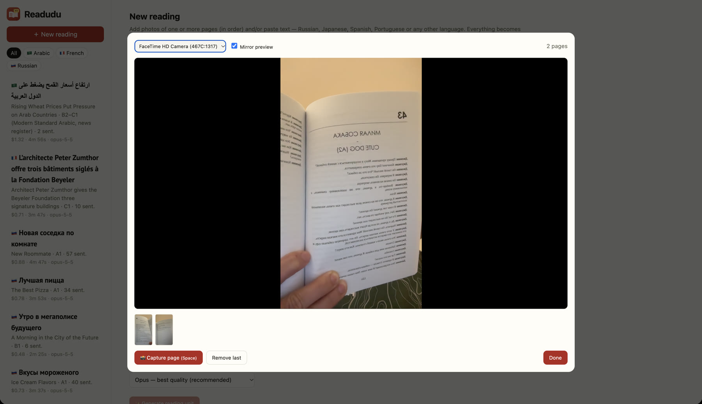
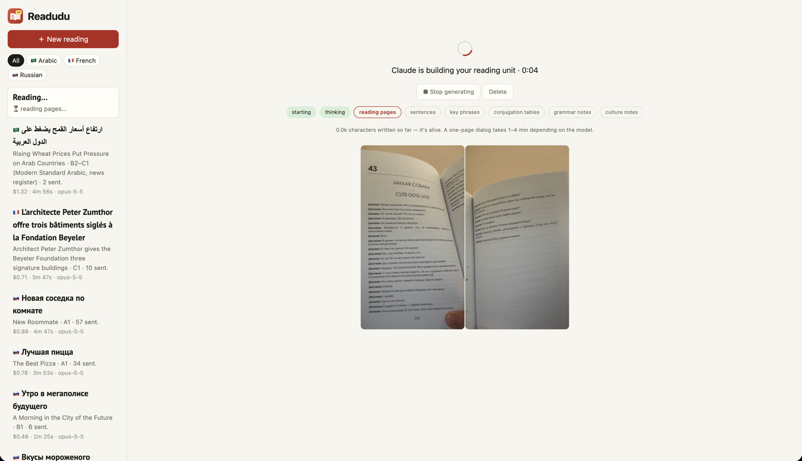
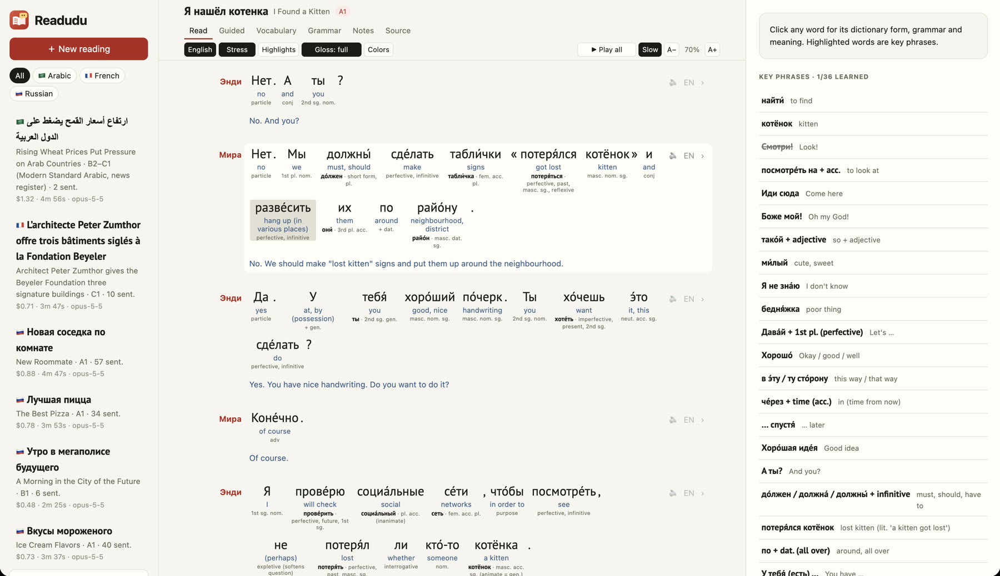
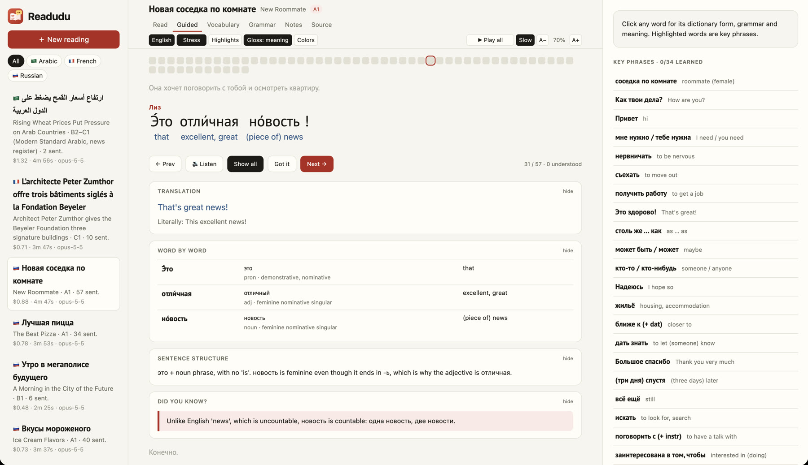
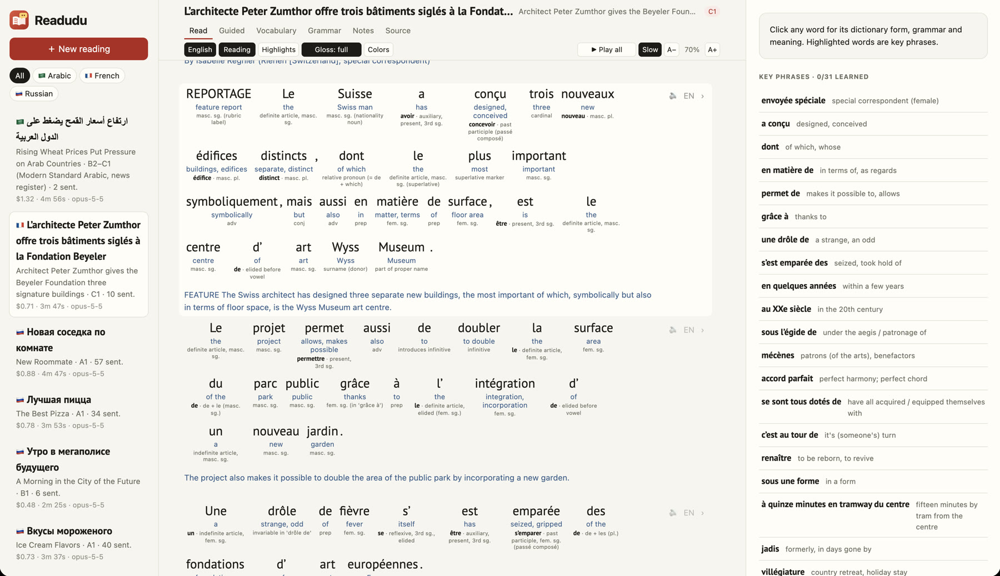
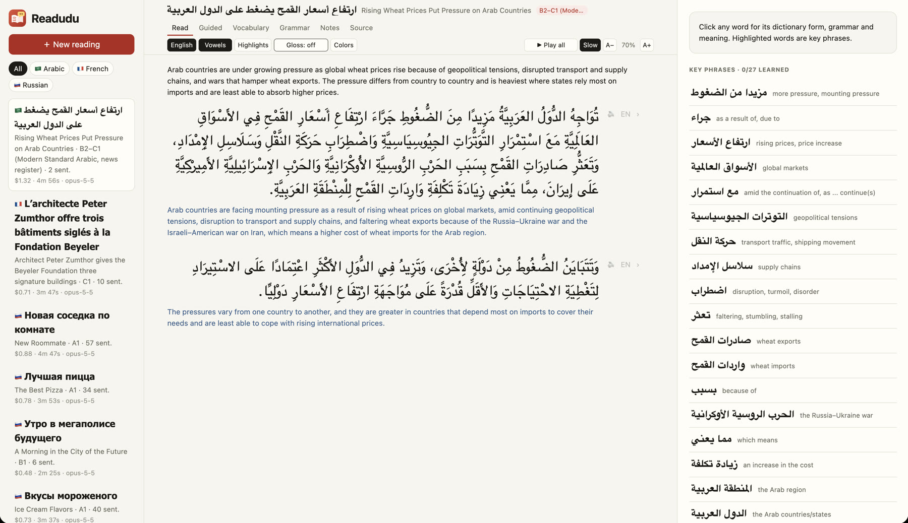
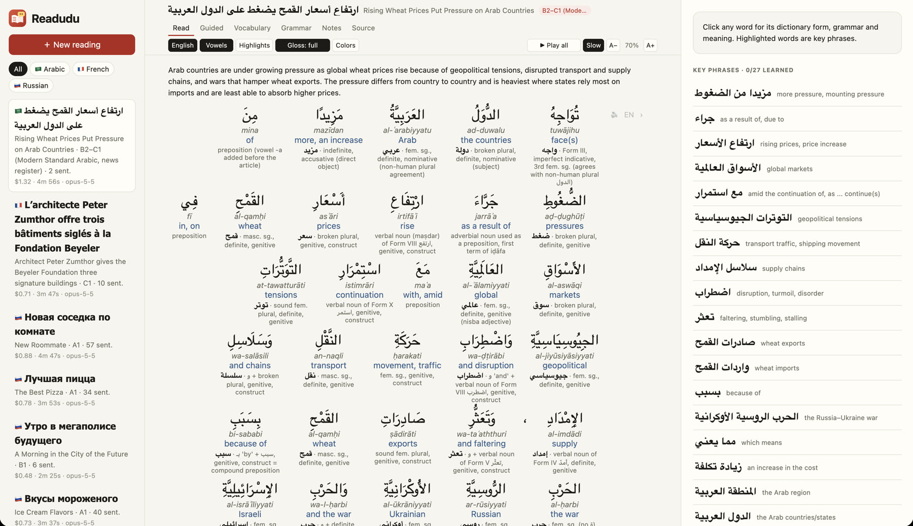
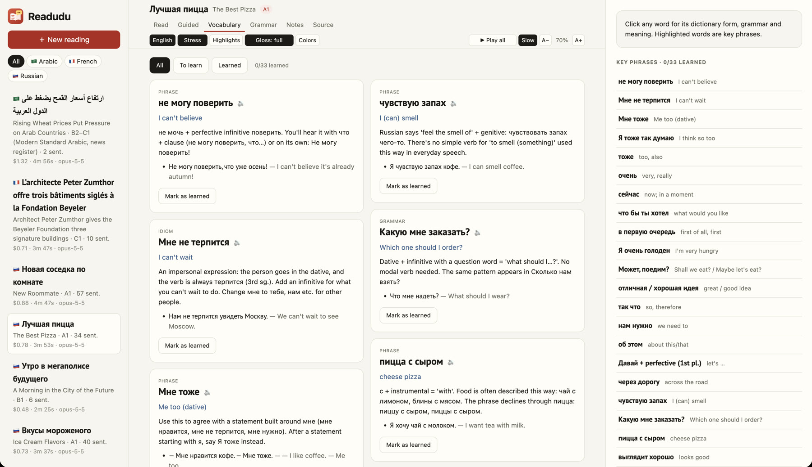
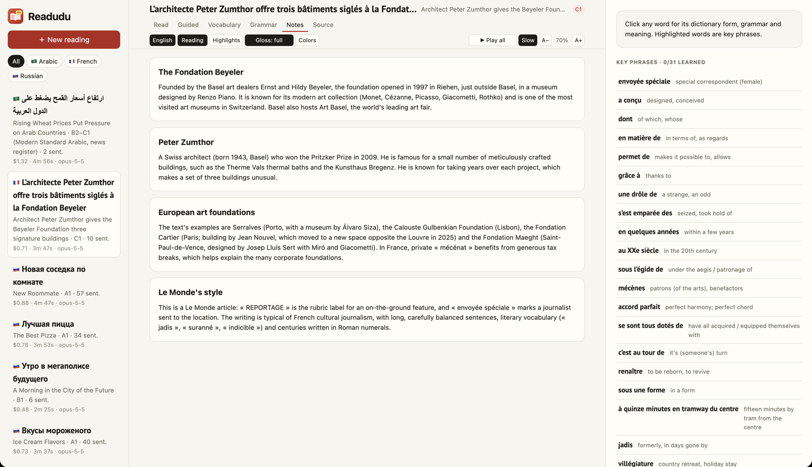

# Readudu


**Turn any page or text in a language you're learning into a guided reading lesson.**

Snap a photo of a textbook page (or several), or paste a paragraph. Readudu builds a reading unit with
sentence-by-sentence translation, a gloss for every word, grammar and structure explanations,
conjugation tables, cultural notes and native-sounding audio. It works for Russian, Japanese,
Spanish, Portuguese and Arabic out of the box (right-to-left scripts included), and other languages also work reasonably well.

It runs entirely on your machine. The AI work is done by your local
[Claude Code](https://claude.com/claude-code) CLI (`claude -p`), so no Anthropic API key is needed.
Your photos, lessons and progress stay in a local folder.

## A quick tour

### Snap the pages

*Hold the book up to your webcam and press Space for each page. The preview is mirrored so it's easy to line up, and
saved photos are not mirrored. Captured pages collect in the strip below, and several pages become one reading. You can
also upload photos, drag and drop, or paste text.*

### One Claude call builds the whole lesson

*A single `claude -p` run reads the pages and writes the whole unit. You can watch its progress step by step and stop it
at any time. The result is saved locally, so opening it again costs nothing.*

### Read, with a gloss under every word

*A Russian textbook dialog, from a single phone photo of the page. **Gloss: full** puts the meaning, dictionary form
and grammar (case, aspect, tense) under every word. Stress marks show where to put the accent, and each line has its own
English translation. The key phrases on the right are highlighted in the text and can be marked as learned.*

### Guided reading, one sentence at a time

*Guided mode steps through the reading sentence by sentence. Each sentence shows a natural and a literal translation,
a word-by-word table, how the sentence is built, and a "Did you know?" note. Here it explains that новость, unlike English
"news", can be counted. The dots track progress, and "Show all" is remembered between sentences.*

### Works for advanced texts too

*A C1-level Le Monde article, pasted as text. Articles, elisions (d', l') and contractions (du = de + le) are all glossed.
The sidebar filters readings by language and shows each unit's generation cost and time.*

### Right-to-left scripts: Arabic

*Arabic reads right to left in a larger sans-serif font. **Vowels** adds the full tashkeel to the printed text.*


*In gloss mode every Arabic word gets a transliteration, its meaning and its grammar: the root, verb form (Form III, Form VIII…),
broken plurals, case, and iḍāfa constructions. Attached prefixes like و and ال are explained as part of the word.*

### Vocabulary cards

*Every reading gets 15–35 key phrases and idioms, each with an explanation and fresh example sentences. You can
filter them to what's left to learn. A glossary of every word in the text sits below.*

### Culture notes

*Background that makes the text make sense: the people, places and customs it mentions, plus notes on style and register.*

## Features

- **Input**: multi-shot webcam capture (mirrored preview), photo upload, drag-and-drop, paste. Several pages plus pasted text become one reading.
- **Read**: the text sentence by sentence, with per-sentence English, audio and "guide me from here". Click any word to see its dictionary form, grammatical form and meaning.
  - **Gloss** mode puts the meaning (and optionally dictionary form, grammar and romanization) under every word.
  - **Colors** color-codes words by part of speech.
  - The reading aid shows **stress marks** for Russian, **furigana** for Japanese, and **vowel marks** (tashkeel/niqqud) for Arabic and Hebrew. Arabic-script languages also show transliteration under each word.
- **Guided**: one sentence at a time, with the translation (natural + literal), a word-by-word table, sentence structure, "Did you know?" anecdotes and inflection tables. Open sections one by one or turn on "Show all" (remembered), and mark sentences as understood.
- **Vocabulary / Grammar / Notes**: key phrases with learned tracking, a glossary of every word, grammar notes, culture notes.
- **Audio**: ElevenLabs (multilingual, two voices for dialog) or the macOS built-in voices. Every clip is generated once and cached.
- **Cost-aware**: one `claude -p` call per reading, with live progress while it runs. The cost is shown for each unit. Results are cached and never regenerated unless you ask. Generations can be stopped.

## Quick start

Requirements: **Node.js 18+**, and **Claude Code** installed and logged in (`claude --version` should work,
and `claude -p "hi"` should answer). There are no npm dependencies.

```bash
git clone https://github.com/wangtian24/readudu.git
cd readudu
cp env.example.yml env.yml     # then edit: add your ElevenLabs key, or set tts_provider: say
npm start                      # → http://localhost:4321
```

Open the page in Chrome or Safari, click **＋ New reading**, add a photo or paste text, and generate.
A one-page dialog takes about 1–4 minutes and roughly $0.40–$1 of Claude usage, depending on length and model.

## Configuration

All settings live in `env.yml`, which is git-ignored; `env.example.yml` documents every key.
Any key can also be set as an upper-case environment variable (e.g. `ELEVENLABS_API_KEY=...`), which takes precedence.

| key | default | meaning |
| --- | --- | --- |
| `port`, `host` | `4321`, `127.0.0.1` | where the server listens (keep it on localhost; there is no auth) |
| `data_dir` | `./data` | photos, generated units, audio cache, progress |
| `claude_bin` | `claude` | the Claude Code CLI to run |
| `model` | `opus` | default model for new units (`opus`, `sonnet`, or a full model id); switchable per unit in the UI |
| `max_parallel_runs` | `3` | units that can generate at once |
| `max_output_tokens` | `64000` | output budget for one generation |
| `tts_provider` | `elevenlabs` | `elevenlabs`, `say` (macOS voices) or `none` |
| `elevenlabs_api_key` | — | needs the text-to-speech permission |
| `elevenlabs_model`, `elevenlabs_voice_female`, `elevenlabs_voice_male` | multilingual v2, Sarah, George | voices used for audio |
| `elevenlabs_voice_<lang>[_female\|_male]` | — | optional native voice per language, e.g. `elevenlabs_voice_fr` (the defaults are English voices and carry an accent) |

Without an ElevenLabs key, audio falls back to macOS `say`. For better quality, install
Premium/Enhanced voices in *System Settings → Accessibility → Spoken Content → Manage Voices*.

## Keyboard

`T` English · `S` stress/furigana · `H` highlights · `G` gloss · `C` colors · `+`/`-` text size · `Esc` stop audio
Guided: `←`/`→` move · `Space` show all (remembered) · `Enter` got it + next · `R` listen. Camera: `Space` captures.

## Your data

Everything is under `data/` (git-ignored):

- `data/units/<id>/`: the page photos, pasted text and `unit.json` (the generated lesson)
- `data/tts/`: cached audio clips plus `index.jsonl` (which text each clip contains)
- `data/state.json`: settings, learned phrases, reading progress

Back it up however you like; nothing leaves your machine except the generation call made through
Claude Code and the text sent to your TTS provider.

## Using other models or providers

Generation lives in one file, `extract.js`: it builds a prompt and a JSON schema and runs one CLI call.
To use a different LLM (the OpenAI, Gemini or Anthropic API, a local model, etc.), replace the `extract()` function so it
returns an object matching `SCHEMA`; nothing else needs to change. Audio is one function in `server.js`.
See [AGENTS.md](AGENTS.md) for the architecture and step-by-step recipes. It's written so you
can hand it to a coding agent.

## Status

A personal learning tool, shared as-is. It is developed on macOS; other OSes should work, except for the `say` fallback.
